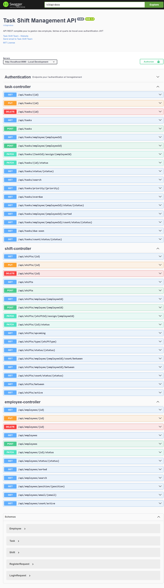
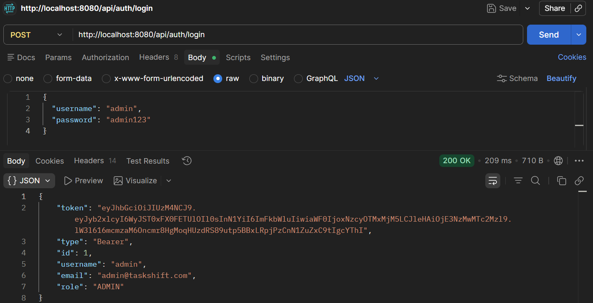
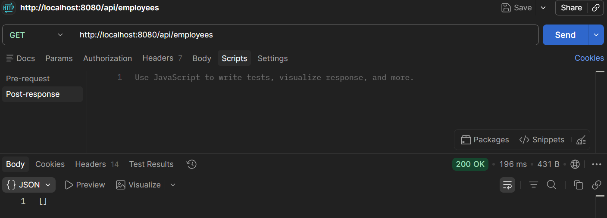
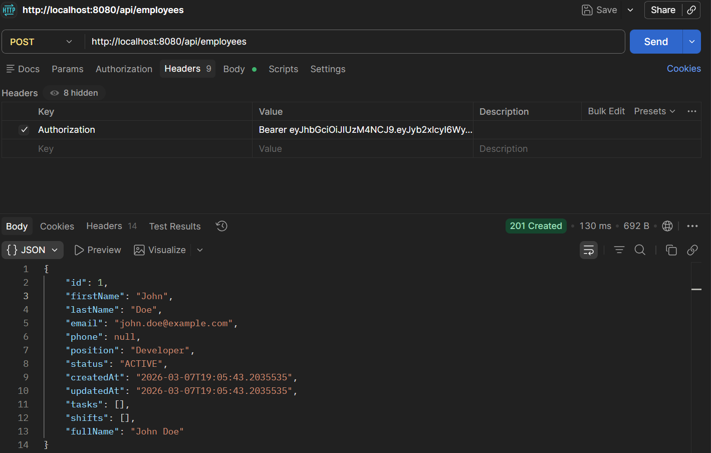
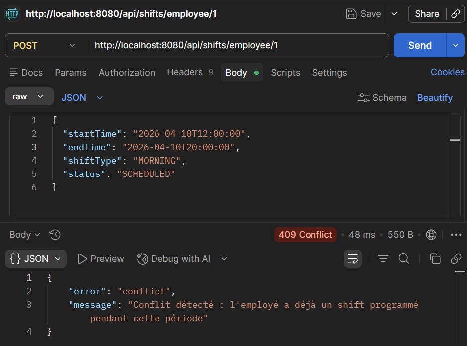

# Task-Shift — Task & Shift Management API

<p align="left">
  
  
  
  
  
  
</p>

> Enterprise-grade REST API for workforce management — employees, tasks, and shifts — secured with JWT authentication and role-based access control.

---

## Overview

Task-Shift provides a complete backend for managing employees, task assignments, and shift scheduling. Key properties:

- **Zero-conflict shift scheduling** with automatic overlap detection
- **JWT + RBAC** security model (ADMIN / MANAGER / EMPLOYEE)
- **34 tests** - unit, service, and integration - all passing
- **Docker-first** deployment with MySQL and phpMyAdmin included
- **OpenAPI/Swagger** interactive documentation at `/swagger-ui.html`

---

## Screenshots

### Swagger UI - 40+ documented endpoints


### JWT Authentication


### Employee CRUD



### Shift Conflict Detection — 409 Conflict


### Test Suite - 31/31 passing


---

## Quick Start

### Local (H2 in-memory)

```bash
git clone https://github.com/Payakan98/Task-Management-API.git
cd Task-Management-API
mvn clean install
mvn spring-boot:run
```

| Endpoint | URL |
|---|---|
| API | http://localhost:8080 |
| Swagger UI | http://localhost:8080/swagger-ui.html |
| H2 Console | http://localhost:8080/h2-console |

### Docker (MySQL)

```bash
docker-compose up -d
```

| Service | Port | Description |
|---|---|---|
| API | 8080 | Spring Boot application |
| MySQL | 3307 | Production database |
| phpMyAdmin | 8081 | Database management UI |

Configure via `.env`:

```env
MYSQL_DATABASE=taskshiftdb
MYSQL_USER=taskshift
MYSQL_PASSWORD=taskshift123
APP_JWT_SECRET=your-production-secret-min-32-chars
APP_JWT_EXPIRATION=86400000
```

---

## Authentication

### 1 - Register

```http
POST /api/auth/register
Content-Type: application/json

{
  "username": "admin",
  "email": "admin@example.com",
  "password": "admin123",
  "role": "ADMIN"
}
```

### 2 - Login

```http
POST /api/auth/login
Content-Type: application/json

{
  "username": "admin",
  "password": "admin123"
}
```

Response includes a `token` field. Pass it on subsequent requests:

```http
Authorization: Bearer <token>
```

---

## API Reference

### Authentication

| Method | Endpoint | Auth |
|---|---|---|
| POST | `/api/auth/register` | Public |
| POST | `/api/auth/login` | Public |
| GET | `/api/auth/me` | Required |

### Employees

| Method | Endpoint | Required Role |
|---|---|---|
| GET | `/api/employees` | Any |
| GET | `/api/employees/{id}` | Any |
| GET | `/api/employees/search?keyword=` | Any |
| POST | `/api/employees` | ADMIN, MANAGER |
| PUT | `/api/employees/{id}` | ADMIN, MANAGER |
| DELETE | `/api/employees/{id}` | ADMIN |

### Tasks

| Method | Endpoint | Required Role |
|---|---|---|
| GET | `/api/tasks` | Any |
| GET | `/api/tasks/overdue` | Any |
| POST | `/api/tasks` | Any |
| PUT | `/api/tasks/{id}` | Any |
| PATCH | `/api/tasks/{id}/status` | Any |
| DELETE | `/api/tasks/{id}` | ADMIN |

### Shifts

| Method | Endpoint | Required Role |
|---|---|---|
| GET | `/api/shifts` | Any |
| GET | `/api/shifts/active` | Any |
| GET | `/api/shifts/upcoming` | Any |
| POST | `/api/shifts` | ADMIN, MANAGER |
| PUT | `/api/shifts/{id}` | ADMIN, MANAGER |
| DELETE | `/api/shifts/{id}` | ADMIN |

---

## Security Model

```
Role         Permissions
──────────── ──────────────────────────────────────────────
ADMIN        Full CRUD on all resources
MANAGER      Create & update employees, tasks, shifts
             Read all resources
             No delete access
EMPLOYEE     Read own tasks and shifts
             Update own task status only
```

JWT tokens expire after 24 hours by default (`app.jwt.expiration=86400000`). Rotate `app.jwt.secret` before any production deployment.

---

## Architecture

```
REST Controllers  ←  JWT filter + RBAC
       │
  Service Layer   ←  Business logic, conflict detection, validation
       │
 Repository Layer ←  Spring Data JPA, custom JPQL queries
       │
   Database        ←  MySQL 8.0 (H2 for local dev)
```

---

## Security Features

| Feature | Details |
|---|---|
| JWT Authentication | Signed tokens, 24h expiration |
| RBAC | 3 roles - ADMIN / MANAGER / EMPLOYEE |
| Rate Limiting | `/api/auth/login` - 5 attempts / 15 min per IP (HTTP 429) |
| Input Validation | Bean Validation on all request bodies |
---

## Testing

```bash
# Run all tests
mvn test

# Generate coverage report
mvn clean test jacoco:report
# → target/site/jacoco/index.html
```

Test suite structure:

```
src/test/java/
├── service/
│   ├── EmployeeServiceTest.java
│   ├── TaskServiceTest.java
│   └── ShiftServiceTest.java
├── controller/
│   ├── EmployeeControllerTest.java
│   ├── TaskControllerTest.java
│   └── ShiftControllerTest.java
└── integration/
    └── AuthControllerIntegrationTest.java
```

---

## Tech Stack

| Layer | Technology |
|---|---|
| Framework | Spring Boot 3.2.0 |
| Security | Spring Security + JWT (JJWT) |
| Database | MySQL 8.0 · H2 (dev) |
| ORM | Spring Data JPA / Hibernate |
| Testing | JUnit 5 · Mockito · TestContainers |
| Documentation | Swagger / OpenAPI 3 |
| Build | Maven |
| Containerization | Docker · Docker Compose |
| CI/CD | GitHub Actions |

---

## Roadmap

- [x] JWT authentication & RBAC
- [x] Rate limiting on authentication endpoints (sliding window, HTTP 429)
- [x] Zero-conflict shift scheduling
- [x] Swagger / OpenAPI documentation
- [x] Docker + MySQL deployment
- [x] 31 tests passing - unit, service & integration
- [x] CI/CD pipeline (GitHub Actions)
- [ ] WebSocket real-time notifications
- [ ] Email alerts on task assignment
- [ ] Kubernetes manifests
- [ ] React frontend

---

## License

MIT © [Islem CHOKRI](https://github.com/Payakan98)

